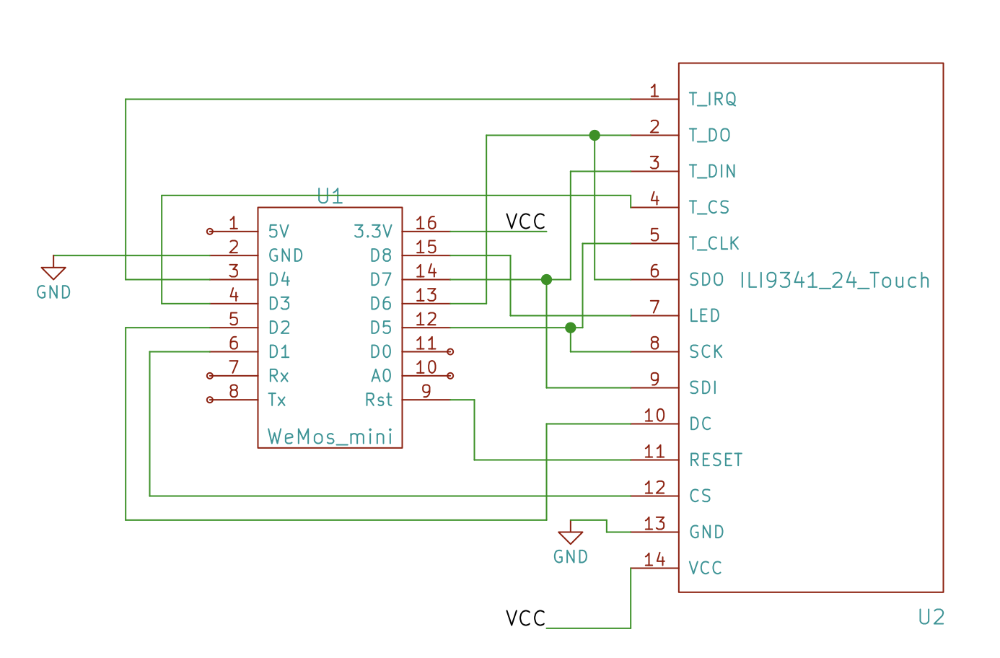

#ESP8266 Plane Spotter Color

This is the repository of the ESP8266 Plane Spotter Color. It downloads data from web APIs and displays aircrafts close
to your location on a map.

## Hardware Requirements

This project was built for the following hardware:
* ESP8266 Wifi chip, especially with the Wemos D1 Mini, but all other ESP8266 modules should work as well
* ILI9341/ XPT2046 TFT display with touch screen. At the moment the touch screen part is not used but I hope to extend it at a later time.

## Wiring/ Schema

If you are currently prototyping this shows how to setup the connections for the above mentioned ILI9341 display

## Libraries

