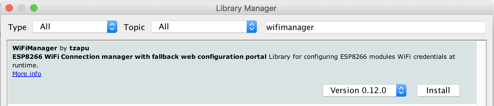
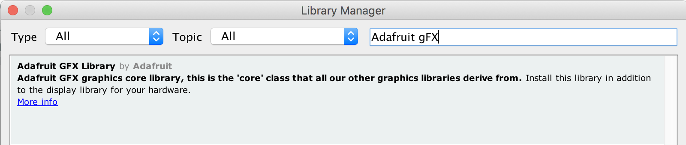

#ESP8266 Plane Spotter Color

This is the repository of the ESP8266 Plane Spotter Color. It downloads data from web APIs and displays aircrafts close
to your location on a map.

## Features
* Beautiful startup splash screen
* Automatic geo location by using WiFi scanning. List of visible SSIDs identifies your location
* Automatic download of JPEGs from MapQuest
* Detailed information about the nearest aircraft
* Flight track: last 20 waypoints per aircraft displayed

## Known Issues
* Flickering with every update: not enough memory for frame/ double buffering
* Sometimes waypoints get lost


## Hardware Requirements

This project was built for the following hardware:
* ESP8266 Wifi chip, especially with the Wemos D1 Mini, but all other ESP8266 modules should work as well
* ILI9341/ XPT2046 TFT display with touch screen. At the moment the touch screen part is not used but I hope to extend it at a later time.

## Wiring/ Schema

If you are currently prototyping this shows how to setup the connections for the above mentioned ILI9341 display


## Libraries

Install the following libraries:

### WifiManager by tzapu



### Json Streaming Parser by Daniel Eichhorn

![Json Streaming Parser] (images/JsonStreamingParserLib.png)

### JPEGDecoder, fork by Frederic Plante

This is (not yet?) available through the library manager. You have to download it from here and add it to the Arduino IDE
https://github.com/fredericplante/JPEGDecoder

*Attention:* You'll also have to open User_config.h in Arduino/libraries/JPEGDecoder-master and change 
```
#define USE_SD_CARD
//#define USE_SPIFFS
```
into
```
//#define USE_SD_CARD
#define USE_SPIFFS
```
### Adafruit GFX by Adafruit


